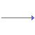

## Διάγραμμα Ροής Δεδομένων

Τα δεδομένα "ρέουν" και μετασχηματίζονται σε νέα δεδομένα από μονάδες λογισμικού / μετασχηματισμούς. Το διάγραμμα αυτό δεν περιέχει τον χρόνο σαν πληροφορία. 

### Πληροφορίες που προσφέρουν τα ΔΡΔ:

- Τις εισόδους / εξόδους του λογισμικού
- Τις βασικές λειτουργίες αλλά και τις υπόλοιπες μονάδες / υπομονάδες του λογισμικού
- Τις αποθήκες δεδομένων που θα χρησιμοποιηθούν
- Τις ροές δεδομένων από / προς το περιβάλλον του λογισμικού αλλά και μεταξύ των διαφόρων μονάδων του λογισμικού

### Συμβολισμοί στα Δ.Ρ.Δ. και κανόνες

| Σχήμα                                | Περιγραφή                              | Κανόνες και σημειώσεις                                                                                                                                                                                                                                                                                                                                                                                                                                  |
| ------------------------------------ | -------------------------------------- | ------------------------------------------------------------------------------------------------------------------------------------------------------------------------------------------------------------------------------------------------------------------------------------------------------------------------------------------------------------------------------------------------------------------------------------------------------- |
|     | Διαδικασία / μετασχηματισμός δεδομένων | 1. Μετασχηματίζει δεδομένα, που ονομάζονται δεδομένα εισόδου, και παράγει δεδομένα, που ονομάζονται δεδομένα εξόδου.  2. Ουσιαστικά είναι κώδικας, λόγος ύπαρξης του οποίου στο ΔΡΔ είναι να καταλάβουμε τι θα υλοποιηθεί.  3. Μπορώ να βάλω ελεύθερα όσα θέλω, με περιορισμούς αναλόγως το επίπεδο που βρίσκομαι.  4. ΔΕΝ ΥΠΑΡΧΕΙ ΜΕΤΑΣΧΗΜΑΤΙΣΜΟΣ που να έχει μόνο είσοδο δεδομένων ή μόνο έξοδο δεδομένων. ΠΡΕΠΕΙ ΝΑ ΕΧΕΙ ΚΑΙ ΤΑ 2. |
|  | Εξωτερική πηγή ή αποδέκτης δεδομένων   | 1. Πηγή και αποδέκτης μπορεί να είναι ο χρήστης του συστήματος, καθώς και εξωτερικές εφαρμογές.  2. Προσοχή στην απόδοση ονομασίας, το "ΧΡΗΣΤΗΣ" είναι καλό να αποφεύγεται.  3. Η πηγή μπορεί να επαναλαμβάνεται και πάνω από μια φορά στο ίδιο ΔΡΔ, για λόγους καλής διευθέτησης.                                                                                                                                                          |
|      | Ροή δεδομένων                          |                                                                                                                                                                                                                                                                                                                                                                                                                                                         |
|    | Αποθήκη δεδομένων                      | 1. Η αποθήκη, γενικά, είναι κομμάτι της εφαρμογής. Αυτό μπορεί και να παραβιάζεται, δεδομένου πως συχνά ασχολούμαστε με κομμάτια εφαρμογών.                                                                                                                                                                                                                                                                                                             |

**Γενικοί κανόνες:**

1. Όλοι οι συμβολισμοί πρέπει να έχουν μέσα (ή πάνω στην περίπτωση της ροής) ένα κείμενο. Τα κείμενα προσπαθούμε να έχουν μια λογική. Πχ, η διαδικασία να δείχνει μια ενέργεια. 
2. Οι αποθήκες και οι πηγές δεν μπορούν να επικοινωνούν μεταξύ τους, χωρίς να υπάρχει ενδιάμεσος μετασχηματισμός. Διαφορετικά, σε κάθε ροη δεδομένων, πρέπει είτε στην αρχή, είτε στο τέλος του βέλους, να υπάρχει μετασχωματισμός.

### Επίπεδα

Για τις ανάγκες του μαθήματος θα περιοριστούμε σε 3 επίπεδα ανάλυσης

1. **Πρώτο επίπεδο:** Στο πρώτο επίπεδο (επίπεδο 0) περιγράφονται μόνο οι πηγές και οι αποδέκτες, άρα *ΟΧΙ ΑΠΟΘΗΚΕΣ ΔΕΔΟΜΕΝΩΝ*. Το σύστημα επίσης περιέχει μόνο έναν μετασχηματισμό.
   
2. **Δεύτερο επίπεδο:** Στο δεύτερο επίπεδο (επίπεδο 1) περιγράφονται οι πηγές, οι αποδέκτες, οι βασικές λειτουργίες και τα κυριότερα αρχεία. 
   
   Αν σπάσω μια λειτουργία σε περισσότερες (από επίπεδο 0 σε επίπεδο 1 πχ), αυτές οι βασικές λειτουργίες θα επικοινωνούν μεταξύ τους ταυτόχρονα, αν συνδέονται μεταξύ τους με ένα βελάκι, και όχι ταυτόχρονα, αν η μια γράφει σε μια αποθήκη και η άλλη διαβάζει. Συνήθως η ταυτόχρονη επικοινωνία βρίσκεται στο επίπεδο 2
   
3. **Τρίτο επίπεδο:** Στο τρίτο επίπεδο (επίπεδο 2) περιγράφεται πιο αναλυτικά η κάθε βασική λειτουργία. 

Εκτός των χαρακτηριστικών, υπάρχουν φορές τις οποίες θα μπορέσουμε να διακρίνουμε σε ποιο επίπεδο βρισκόμαστε και από την αρίθμηση. Π.χ., το P1.3.1 "μαρτυρά" πως είμαστε στο επίπεδο 2. Η αρίθμηση της ανάλυσης σε επίπεδα πρέπει να είναι δομημένη, πχ επίπεδο 0 P1, επίπεδο 1 P1.1, P1.2 και P1.3, επίπεδο 3...

***ΠΡΟΣΟΧΗ:*** Οι πηγές και οι αποδέκτες πρέπει να είναι ίδιοι ανάμεσα σε όλα τα επίπεδα. Αν αυτό παραβιαστεί, και ένα δεδομένο, χάρην ακρίβειας, διασπαστεί σε περισσότερα στοιχεία, σε μεταγενέστερο επίπεδο (π.χ. ο ΠΕΛΑΤΗΣ να γίνει ΣΤΟΙΧΕΙΑ ΠΕΛΑΤΗ και ΚΩΔΙΚΟΣ ΠΕΛΑΤΗ), αυτό θα πρέπει να καταγραφεί στο λεξικό δεδομένων.

**Συμβουλή:** Αποφεύγουμε την υπερανάλυση. Αν στην εργασία βγούν πάνω από 6-7 μετασχηματισμοί, κάτι έχει γίνει λάθος,

### Επιπλέον σημειώσεις   `

- Τα ΔΡΔ δε περιγράφουν αλγορίθμους, χρονική αλληλουχία ή συμπεριφορά του λογισμικού.   
- Δεν είναι δαιγράμματα προγράμματος.   
- Δεν σχετίζονται με τον προγραμματισμό και τις γλώσσες προγραμματισμού.

## Διάγραμμα Δομής Προγράμματος

### Συμβολισμοί στα Δ.Δ.Π. και κανόνες

| Σχήμα                                        | Περιγραφή                                                                                                                                                                                                                                                                       |
| -------------------------------------------- | ------------------------------------------------------------------------------------------------------------------------------------------------------------------------------------------------------------------------------------------------------------------------------- |
|          | Ονομάζεται μονάδα.                                                                                                                                                                                                                                                           |
|              | Συνδέει τις μονάδες, το βελάκι δείχνει πάντα προς τις κάτω μονάδες                                                                                                                                                                                                              |
|  | Μπαίνει δίπλα από τα βελάκια και δείνχει προς την μονάδα που λαμβάνει δεδομένα.Σε περιπτώσεις που η μονάδα Α ανταλλάσει δεδομέναμε την μονάδα Β, μπορεί να υπάρχει και 2 φορές το στοιχείο αυτό, μια που να δείχνει προς την μονάδα Α, και μια να δείχνει προς την μονάδα Β  |

**Κεντρικός μετασχηματισμός δ.ρ.δ.:** Το κεντρίκό σημείο ενός ΔΡΔ. Ο μετασχηματισμός που υποστηρίζει τη βασική επεξεργασία του ΔΡΔ. Είναι ο μετασχηματισμός με τον μεγαλύτερο αριθμό στοιχείων εισόδου και εξόδου αθροιστικά (έχει τον μεγαλύτερο βαθμό επικοινωνίας). Συνήθως βρίσκεται στο / προς το κέντρο.
### Εύρεση Δ.Δ.Ρ. και ονοματοδοσία

1. Βρίσκουμε τον κεντρικό μετασχηματισμό του δ.ρ.δ. Σπανίως ίσως να είναι και 2 οι κεντρικοί μετασχηματισμοί.
2. Τον / Τους βάζουμε σε μια μονάδα, με όνομα **EXEC**
3. Ακριβώς από κάτω του βάζουμε μια μονάδα για κάθε κεντρικό μετασχηματισμό, με το όνομα **CALC**
4. Γράφουμε με μονάδες εισόδου και εξόδου τις πηγές και αποδέκτες του κεντρικού μετασχηματισμού, με ονομασίες **GET** και **PUT** αντίστοιχα.
5. Αν θέλουμε να συνεχίζουμε το διάγραμμα ροής, ώστε να εκφράζει όλο το δ.ρ.δ., τότε αντί για **GET** και **PUT**, στους μετασχηματισμούς που γράψαμε ως get και put, βάζουμε **EXEC** και φερόμαστε όπως φερθήκαμε στον κεντικό μετασχηματισμό
6. Καταλήγουμε να έχουμε τόσα **GET** όσες και οι πηγές του προγράματος και οι αποθήκες, και τόσα **PUT** όσες και οι αποδέκτες του προγράμματος και οι αποθήκες

## Ψευδοκώδικας

### Τελεστές

| **Εντολή** | **Αντοιστιχία σε C** | **Αντιστοιχία σε  Ψευδοκώδικα  Πλη10** | **Περιγραφή**   | **Παράδειγμα σε ψευδογλώσσα** |
| ---------- | -------------------- | -------------------------------------------- | --------------- | ----------------------------- |
| `+`        | `+`                  | `+`                                          | Πρόσθεση        |                               |
| `-`        | `-`                  | `-`                                          | Αφαίρεση        |                               |
| `*`        | `*`                  | `*`                                          | Πολλαπλασιασμός |                               |
| `/`        | `/`                  | `/`                                          | Διαίρεση        |                               |
| ^          |                      |                                              | Ύψωση σε δύναμη |                               |

### Βασική σύνταξη

| **Εντολή**             | **Αντοιστιχία σε C**                 | **Αντιστοιχία σε  Ψευδοκώδικα  Πλη10** | **Περιγραφή**     | **Παράδειγμα σε ψευδογλώσσα** |
| ---------------------- | ------------------------------------ | -------------------------------------------- | ----------------- | ----------------------------- |
| /\* \*/                |                                      | /\* \*/                                      | Σχόλιο            | /\* σχόλιο \*/                |
| :=                     | =                                    | :=                                           | Ανάθεση           | Αριθμός_μητρωου := 9          |
| `VAR` ονομα_μεταβλητής | τύπος\_μεταβλητής όνομα\_μεταβλητής; |                                              | Δήλωση μεταβλητής |                               |
|                        |                                      |                                              |                   |                               |

### Δομές ελέγχου

| **Εντολή**                                                                                                  | **Αντοιστιχία σε C**                                                                                           | **Αντιστοιχία σε  Ψευδοκώδικα  Πλη10**               | **Περιγραφή**                                                                                       | **Παράδειγμα σε ψευδογλώσσα** |
| ----------------------------------------------------------------------------------------------------------- | -------------------------------------------------------------------------------------------------------------- | ---------------------------------------------------------- | --------------------------------------------------------------------------------------------------- | ----------------------------- |
| `IF` συνθήκη `THEN`  `ELSE`  `END_IF`                                                           | `if (`συνθήκη`)` {  `} else {`  `}`                                                                | `ΕΑΝ (`συνθήκη`) ΤΟΤΕ`  `ΑΛΛΙΩΣ`  `ΕΑΝ-ΤΕΛΟΣ;` | Έλεγχος μιας συνθήκης και εκτέλεση  κώδικα αναλόγως με το αν η  συνθήκη είναι αληθής ή ψευδής |                               |
| `CASE` έκφραση`OF` (τιμή 1) ενέργειες ... (τιμή n) ενέργειες OTHERWISE ενέργειες END CASE | `switch` έκφραση { `case` τιμή 1: ενέργειες ... `case` τιμή n: ενέργειες `default:` ενέργειες } |                                                            |                                                                                                     |                               |

### Δομές επανάληψης

| **Εντολή**                                                                 | **Αντοιστιχία σε C**                | **Αντιστοιχία σε  Ψευδοκώδικα  Πλη10**    | **Περιγραφή**                                                         | **Παράδειγμα σε ψευδογλώσσα** |
| -------------------------------------------------------------------------- | ----------------------------------- | ----------------------------------------------- | --------------------------------------------------------------------- | ----------------------------- |
| `FOR` μεταβλητή `FROM` τιμή1 `TO` τιμή2 `STEP` τιμή3 `DO`  `END_FOR` | `for` (συνθήκη) `{`  `}`      | `ΓΙΑ` (συνθήκη) `ΕΠΑΝΑΛΑΒΕ`  `ΓΙΑ-ΤΕΛΟΣ;` | Βρόχος  επανάληψης με  αρχικοποίηση, συνθήκη. Σε μία γραμμή! |                               |
| `WHILE` συνθήκη `DO`  `END WHILE`                                    |                                     |                                                 |                                                                       |                               |
| `REPEAT`  `UNTIL` συνθήκη                                            | `do {`   `}while(`συνθήκη`);` | `ΕΠΑΝΑΛΑΒΕ`  `ΜΕΧΡΙ` (συνθήκη);           |                                                                       |                               |

### Διαδικασίες και συναρτήσεις

Οι διαδικασίες (procedures) και οι συναρτήσεις (functions) είναι μονάδες προγράμματος. 

Η διαφορά τους είναι ότι η συνάρτηση επιστρέφει μια τιμή ως αποτέλεσμα της εκτέλεσής της. Η διαδικασία δεν επιστρέφει τιμή άμεσα. Η διαδικασία μπορεί να επιστρέψει τιμή όταν δέχεται μια παράμετρο που είναι OUT, η οποία, μετά την εκτέλεση της διαδικασίας, θα είναι διαθέσιμη σε όλο το πρόγραμμα.

| **Εντολή**                                                                            | **Παράδειγμα σε ψευδογλώσσα**                                                                                                                                | **Περιγραφή**                                                                                                           |
| ------------------------------------------------------------------------------------- | ------------------------------------------------------------------------------------------------------------------------------------------------------------ | ----------------------------------------------------------------------------------------------------------------------- |
| `procedure` ονομα_διαδικασίας`(a: in,` ... `, k: in, l: out )`  `end procedure` | `procedure προσθεσε_αριθμους(a:in, b:in, c:out)` `c := a + b` `end procedure`                                                                          | Η μεταβλητή c θα είναι διαθέσιμη μετά την εκτέλεση  της διαδικασίας.                                              |
| Call ονομα_διαδικασίας                                                                | `Local var num1, num2, num3;` `num1 := 3` `num2 := 2` `Call πρόσθεσε_αριθμούς(num1, num2, num3)`                                                    | Καλεί την διαδικασία                                                                                                    |
| `Function` ονομα_συναρτησης`(a: in,` ...`, k: in)`  `end_function`              | `Function προσθεση_αριθμων(a:in, b:in)` `προσθεση_αριθμων := a + b` `end_function`  `local var addition` `addition := προσθεση_αριθμων(2, 3)` | ***ΠΡΟΣΟΧΗ:*** Βάζω το αποτέλεσμα που θέλω να επιστρέψω σε μεταβλητή με όνομα ίδιο με αυτό της function. |
